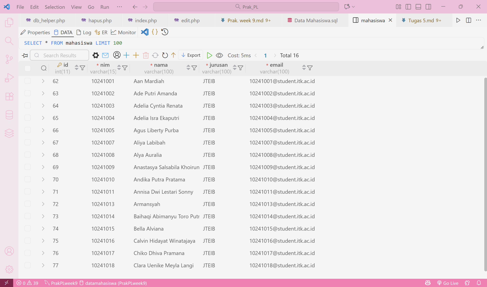
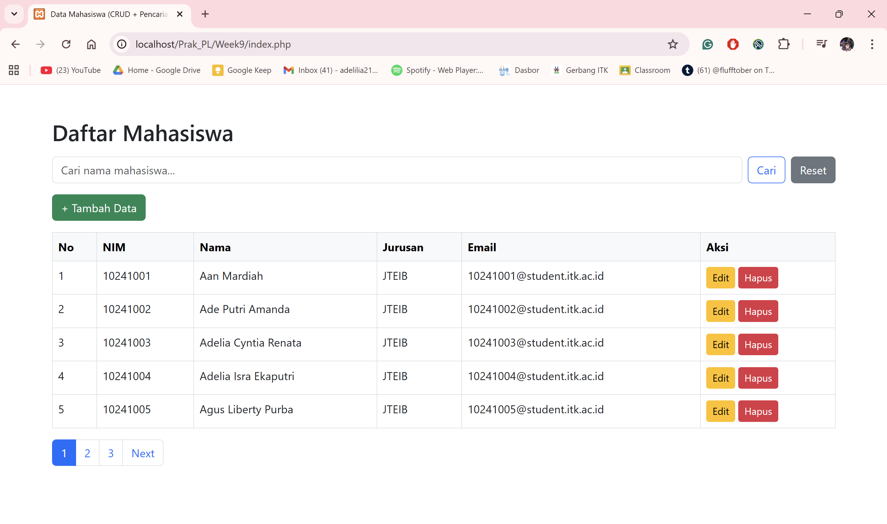
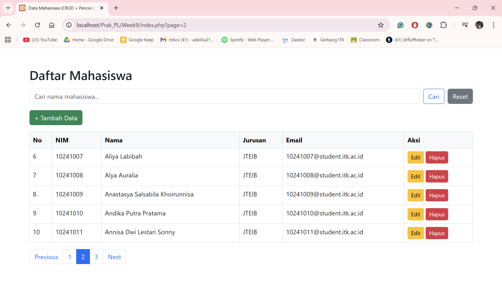

# <center>Tugas Praktikum Pemrograman Lanjut Modul 6<center>
Nama: Adelia Isra Ekaputri  
NIM: 10241004

1. Buatlah sebuah aplikasi CRUD sederhana untuk mengelola data mahasiswa (nim, nama, jurusan, email) menggunakan PDO.   
   Jawaban: Berikut merupakan aplikasi CRUD yang sudah saya buat.
- Tampilan awal:
  

- Create: Bagian Create digunakan untuk menambah data baru ke dalam database. Pada sistem ini, berarti pengguna dapat memasukkan data seperti NIM, nama, jurusan, dan email melalui form, lalu sistem menyimpannya ke tabel mahasiswa.  
Tampilan dan alur:


  Pada saat pengguna masuk ke tampilan awal, mereka akan menekan tombol "+Tambah Data". Selanjutnya mereka akan mengisi data mereka sesuai dengan yang di minta pada formulir. Setelah selesai mengisi, pengguna akan menekan tombol simpan untuk mengakhiri proses.

  Data baru yang sudah dibuat (telah masuk ke database):


  Kode:
```php
<?php
require 'config.php';

if (isset($_POST['submit'])) {
    $nim = $_POST['nim'];
    $nama = $_POST['nama'];
    $jurusan = $_POST['jurusan'];
    $email = $_POST['email'];

    $query = "INSERT INTO mahasiswa (nim, nama, jurusan, email) VALUES (:nim, :nama, :jurusan, :email)";
    $stmt = $pdo->prepare($query);
    $stmt->execute(['nim'=>$nim, 'nama'=>$nama, 'jurusan'=>$jurusan, 'email'=>$email]);

    header("Location: index.php");
}
?>

<!DOCTYPE html>
<html>
<head>
    <title>Tambah Data Mahasiswa</title>
    <link rel="stylesheet" href="https://cdn.jsdelivr.net/npm/bootstrap@5.3.0/dist/css/bootstrap.min.css">
</head>
<body class="container mt-5">
    <h2>Tambah Mahasiswa</h2>
    <form method="post">
        <div class="mb-3">
            <label>NIM</label>
            <input type="text" name="nim" class="form-control" required>
        </div>
        <div class="mb-3">
            <label>Nama</label>
            <input type="text" name="nama" class="form-control" required>
        </div>
        <div class="mb-3">
            <label>Jurusan</label>
            <input type="text" name="jurusan" class="form-control" required>
        </div>
        <div class="mb-3">
            <label>Email</label>
            <input type="email" name="email" class="form-control" required>
        </div>
        <button type="submit" name="submit" class="btn btn-success">Simpan</button>
        <a href="index.php" class="btn btn-secondary">Kembali</a>
    </form>
</body>
</html>
```

- Read: Bagian Read digunakan untuk membaca dan menampilkan data yang sudah tersimpan di dalam database. Pada sistem ini fitur Read berfungsi untuk menampilkan daftar mahasiswa dalam bentuk tabel di halaman utama.
Tampilan:


  Kode:
```php
<?php
require 'config.php';

$limit = 5;
$page = isset($_GET['page']) ? (int) $_GET['page'] : 1;
$offset = ($page - 1) * $limit;

$keyword = '';
$params = [];

if (isset($_GET['cari'])) {
    $keyword = trim($_GET['keyword']);
    $stmt = $pdo->prepare("SELECT * FROM mahasiswa WHERE nama LIKE :keyword LIMIT :offset, :limit");
    $stmt->bindValue(':keyword', "%$keyword%", PDO::PARAM_STR);
    $stmt->bindValue(':offset', $offset, PDO::PARAM_INT);
    $stmt->bindValue(':limit', $limit, PDO::PARAM_INT);
    $stmt->execute();

    $countStmt = $pdo->prepare("SELECT COUNT(*) FROM mahasiswa WHERE nama LIKE :keyword");
    $countStmt->execute(['keyword' => "%$keyword%"]);
    $totalRows = $countStmt->fetchColumn();

    $params['cari'] = '1';
    $params['keyword'] = $keyword;
} else {
    $stmt = $pdo->prepare("SELECT * FROM mahasiswa LIMIT :offset, :limit");
    $stmt->bindValue(':offset', $offset, PDO::PARAM_INT);
    $stmt->bindValue(':limit', $limit, PDO::PARAM_INT);
    $stmt->execute();

    $countStmt = $pdo->query("SELECT COUNT(*) FROM mahasiswa");
    $totalRows = $countStmt->fetchColumn();
}

$totalPages = ceil($totalRows / $limit);
$data = $stmt->fetchAll(PDO::FETCH_ASSOC);
?>

<!DOCTYPE html>
<html>
<head>
    <title>Data Mahasiswa (CRUD + Pencarian + Paginasi)</title>
    <link rel="stylesheet" href="https://cdn.jsdelivr.net/npm/bootstrap@5.3.0/dist/css/bootstrap.min.css">
</head>
<body class="container mt-5">

    <h2 class="mb-3">Daftar Mahasiswa</h2>

    <form method="get" class="mb-3 d-flex" role="search">
        <input type="text" name="keyword" class="form-control me-2"
               placeholder="Cari nama mahasiswa..." value="<?= htmlspecialchars($keyword) ?>">
        <button type="submit" name="cari" class="btn btn-outline-primary">Cari</button>
        <a href="index.php" class="btn btn-secondary ms-2">Reset</a>
    </form>

    <a href="tambah.php" class="btn btn-success mb-3">+ Tambah Data</a>

    <table class="table table-bordered">
        <thead class="table-light">
            <tr>
                <th>No</th>
                <th>NIM</th>
                <th>Nama</th>
                <th>Jurusan</th>
                <th>Email</th>
                <th>Aksi</th>
            </tr>
        </thead>
        <tbody>
        <?php if (count($data) === 0): ?>
            <tr>
                <td colspan="6" class="text-center text-muted">Tidak ada data ditemukan.</td>
            </tr>
        <?php else:
            $no = $offset + 1;
            foreach ($data as $row): ?>
            <tr>
                <td><?= $no++ ?></td>
                <td><?= htmlspecialchars($row['nim']) ?></td>
                <td><?= htmlspecialchars($row['nama']) ?></td>
                <td><?= htmlspecialchars($row['jurusan']) ?></td>
                <td><?= htmlspecialchars($row['email']) ?></td>
                <td>
                    <a href="edit.php?id=<?= $row['id'] ?>" class="btn btn-warning btn-sm">Edit</a>
                    <a href="hapus.php?id=<?= $row['id'] ?>" class="btn btn-danger btn-sm"
                       onclick="return confirm('Yakin ingin menghapus data ini?')">Hapus</a>
                </td>
            </tr>
        <?php endforeach; endif; ?>
        </tbody>
    </table>

    <nav>
        <ul class="pagination">
            <?php if ($page > 1): ?>
                <li class="page-item">
                    <a class="page-link" href="?<?= http_build_query(array_merge($params, ['page' => $page - 1])) ?>">Previous</a>
                </li>
            <?php endif; ?>

            <?php for ($i = 1; $i <= $totalPages; $i++): ?>
                <li class="page-item <?= ($i == $page) ? 'active' : '' ?>">
                    <a class="page-link" href="?<?= http_build_query(array_merge($params, ['page' => $i])) ?>">
                        <?= $i ?>
                    </a>
                </li>
            <?php endfor; ?>

            <?php if ($page < $totalPages): ?>
                <li class="page-item">
                    <a class="page-link" href="?<?= http_build_query(array_merge($params, ['page' => $page + 1])) ?>">Next</a>
                </li>
            <?php endif; ?>
        </ul>
    </nav>

</body>
</html>
```

- Update: Bagian Update digunakan untuk mengubah atau memperbarui data yang sudah tersimpan di dalam database. Contohnya pada sistem ini, ketika ada kesalahan pada data mahasiswa, pengguna bisa memperbaikinya melalui form edit, dan sistem akan menyimpan perubahan tersebut ke database.   
Tampilan sebelum diedit:

Berikut merupakan data mahasiswa yang memiliki kesalahan pada bagian email dan ingin di perbaiki.

  Tampilan setelah diedit:


  Database yang sudah diedit:


  Kode:
```php
<?php
require 'config.php';

$id = $_GET['id'];
$stmt = $pdo->prepare("SELECT * FROM mahasiswa WHERE id = :id");
$stmt->execute(['id' => $id]);
$mhs = $stmt->fetch(PDO::FETCH_ASSOC);

if (isset($_POST['update'])) {
    $nim = $_POST['nim'];
    $nama = $_POST['nama'];
    $jurusan = $_POST['jurusan'];
    $email = $_POST['email'];

    $query = "UPDATE mahasiswa SET nim=:nim, nama=:nama, jurusan=:jurusan, email=:email WHERE id=:id";
    $stmt = $pdo->prepare($query);
    $stmt->execute([
        'nim'=>$nim,
        'nama'=>$nama,
        'jurusan'=>$jurusan,
        'email'=>$email,
        'id'=>$id
    ]);

    header("Location: index.php");
}
?>

<!DOCTYPE html>
<html>
<head>
    <title>Edit Data Mahasiswa</title>
    <link rel="stylesheet" href="https://cdn.jsdelivr.net/npm/bootstrap@5.3.0/dist/css/bootstrap.min.css">
</head>
<body class="container mt-5">
    <h2>Edit Mahasiswa</h2>
    <form method="post">
        <div class="mb-3">
            <label>NIM</label>
            <input type="text" name="nim" value="<?= $mhs['nim'] ?>" class="form-control" required>
        </div>
        <div class="mb-3">
            <label>Nama</label>
            <input type="text" name="nama" value="<?= $mhs['nama'] ?>" class="form-control" required>
        </div>
        <div class="mb-3">
            <label>Jurusan</label>
            <input type="text" name="jurusan" value="<?= $mhs['jurusan'] ?>" class="form-control" required>
        </div>
        <div class="mb-3">
            <label>Email</label>
            <input type="email" name="email" value="<?= $mhs['email'] ?>" class="form-control" required>
        </div>
        <button type="submit" name="update" class="btn btn-primary">Update</button>
        <a href="index.php" class="btn btn-secondary">Kembali</a>
    </form>
</body>
</html>
```

- Delete: Bagian Delete berfungsi untuk menghapus data tertentu dari database. Contohnya pada sistem ini, ketika seorang mahasiswa sudah lulus atau resign, pengguna bisa menghapusnya dari sistem melalui tombol 'Hapus'.  
Kode:
```php
<?php
require 'config.php';

$id = $_GET['id'];
$stmt = $pdo->prepare("DELETE FROM mahasiswa WHERE id = :id");
$stmt->execute(['id' => $id]);

header("Location: index.php");
?>
```

2. Implementasikan fitur pencarian data mahasiswa berdasarkan nama menggunakan LIKE dan prepared statement.   
Jawaban: Fitur ini memungkinkan pengguna untuk mencari data mahasiswa berdasarkan nama yang diketikkan di kolom pencarian pada halaman utama. Contohnya, jika pengguna mengetik "ad", maka sistem akan menampilkan semua mahasiswa yang namanya menggandung "ad".
Tampilan:


3. Tambahkan fitur paginasi pada halaman tampilan data mahasiswa untuk membatasi jumlah data yang ditampilkan per halaman.   
Jawaban: Paginasi adalah fitur untuk membagi tampilan data menjadi beberapa halaman, agar tidak semua data tampil sekaligus di satu halaman.  
Tampilan data 1-5:

Tampilan data 6-10:

Tampilan data 11-15:


4. Buatlah sebuah fungsi PHP reusable untuk menangani koneksi database dan error handling, sehingga tidak perlu menulis ulang kode koneksi di setiap file.   
Jawaban: Fungsi reusable adalah fungsi yang dibuat satu kali tetapi bisa dipanggil di banyak file tanpa menulis ulang kodenya.
```php
<?php
function getConnection() {
    $host = 'localhost';
    $dbname = 'kampus';
    $username = 'root';
    $password = '';

    try {
        $pdo = new PDO("mysql:host=$host;dbname=$dbname;charset=utf8", $username, $password);
        $pdo->setAttribute(PDO::ATTR_ERRMODE, PDO::ERRMODE_EXCEPTION);
        return $pdo;
    } catch (PDOException $e) {
        die("<strong>Koneksi gagal:</strong> " . htmlspecialchars($e->getMessage()));
    }
}
?>
```

5. Jelaskan dengan contoh kode perbedaan antara bindParam() dan bindValue() dalam sebuah skenario di mana nilai variabel berubah setelah diikat tetapi sebelum
execute() dipanggil.  
Jawaban:
- `bindParam()`: Menyimpan referensi ke variabel, nilainya dibaca saat `execute()` dipanggil.
- `bindValue()`: Menyimpan nilai saat itu juga, nilainya tidak berubah meskipun variabel berubah.
Contoh skenario:
Kita punya tabel mahasiswa:
```sql
CREATE TABLE mahasiswa (
  id INT AUTO_INCREMENT PRIMARY KEY,
  nama VARCHAR(100)
);
```
Lalu kita ingin menyisipkan nama mahasiswa ke tabel ini.

Contoh dengan `bindParam()`:
```php
<?php
require 'db_helper.php';
$pdo = getConnection();

$query = "INSERT INTO mahasiswa (nama) VALUES (:nama)";
$stmt = $pdo->prepare($query);

$nama = "Andi";
$stmt->bindParam(':nama', $nama);

$nama = "Budi";

$stmt->execute();

echo "Data tersimpan dengan nama: $nama";
?>
```
Hasil pada database akan menunjukkan `nama = Budi`  
Karena `bindParam()` mengikat variabel secara referensi, PDO baru membaca nilainya `ketika execute()` dijalankan.
Jadi, walaupun awalnya `$nama = "Andi"`, nilai yang tersimpan adalah "Budi".

Contoh dengan `bindValue()`:
```php
<?php
require 'db_helper.php';
$pdo = getConnection();

$query = "INSERT INTO mahasiswa (nama) VALUES (:nama)";
$stmt = $pdo->prepare($query);

$nama = "Andi";
$stmt->bindValue(':nama', $nama);

$nama = "Budi";

$stmt->execute();

echo "Data tersimpan dengan nama: $nama";
?>
```
Hasil pada database akan menunjukkan `nama = Budi`  
Karena `bindValue()` langsung menyimpan nilai saat pemanggilan fungsi, perubahan variabel setelah itu tidak berpengaruh pada nilai yang dikirim ke query.